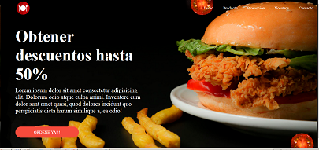
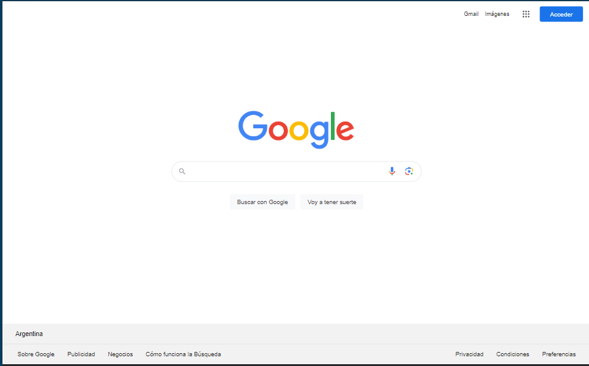

# 🤯👇🏽challengesCDC👩🏼‍💻💆🏼‍♀️

Desafios de replicacion de páginas web de Codo a codo solo con css y html.

##### * Los proyectos tienen incorporado el css en el head, excepto el Google actual que está en la crpeta currentGoogle.

## [Google 1998](https://oldgoogle.neocities.org/1998/)

## Flyer descuento Burger

## [Google actual](https://www.google.com/?pccc=1)

###### *Sin microfono y sin camara

## Desafio grupal 1
- duplicar un diseño basico con header y nav sticky al hacer scroll
